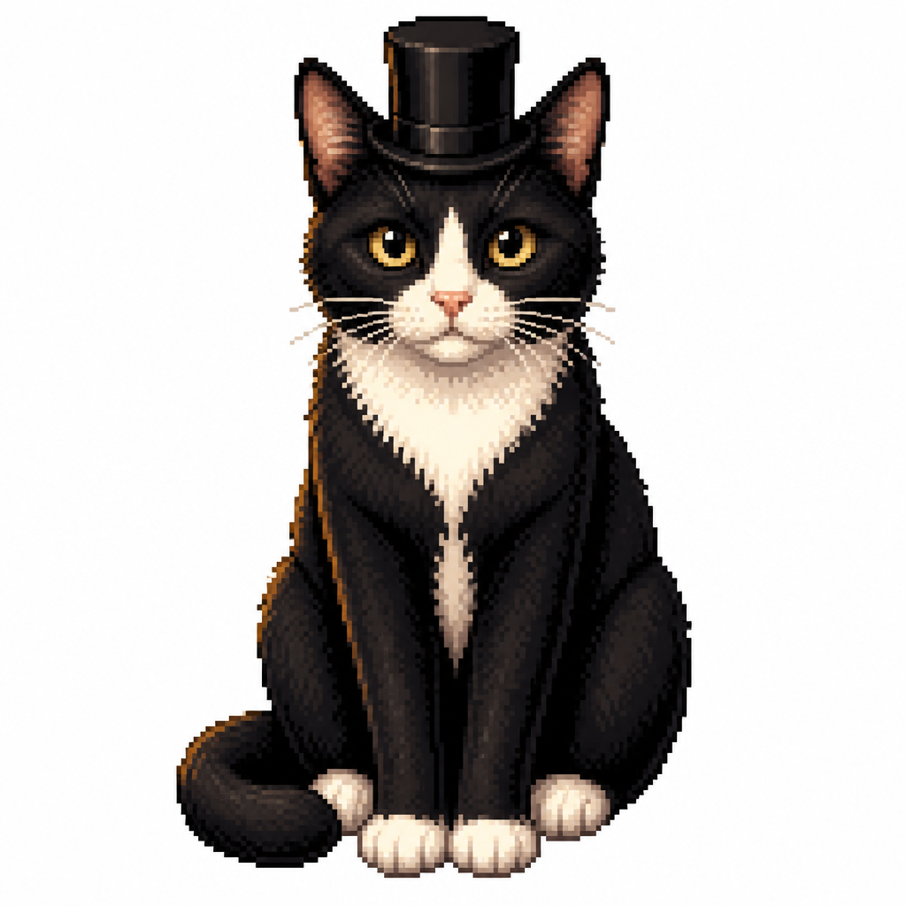
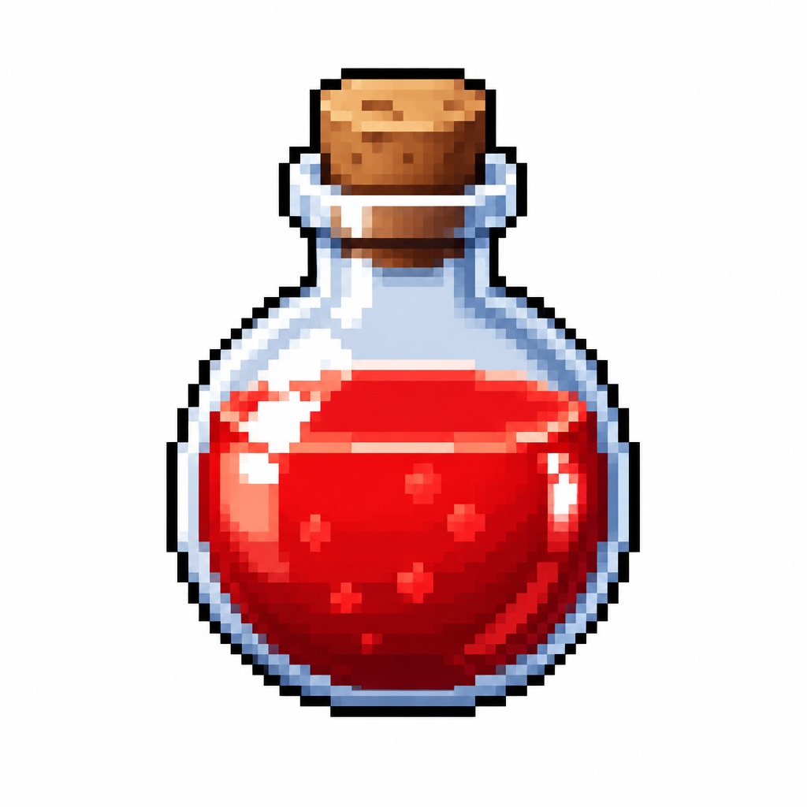
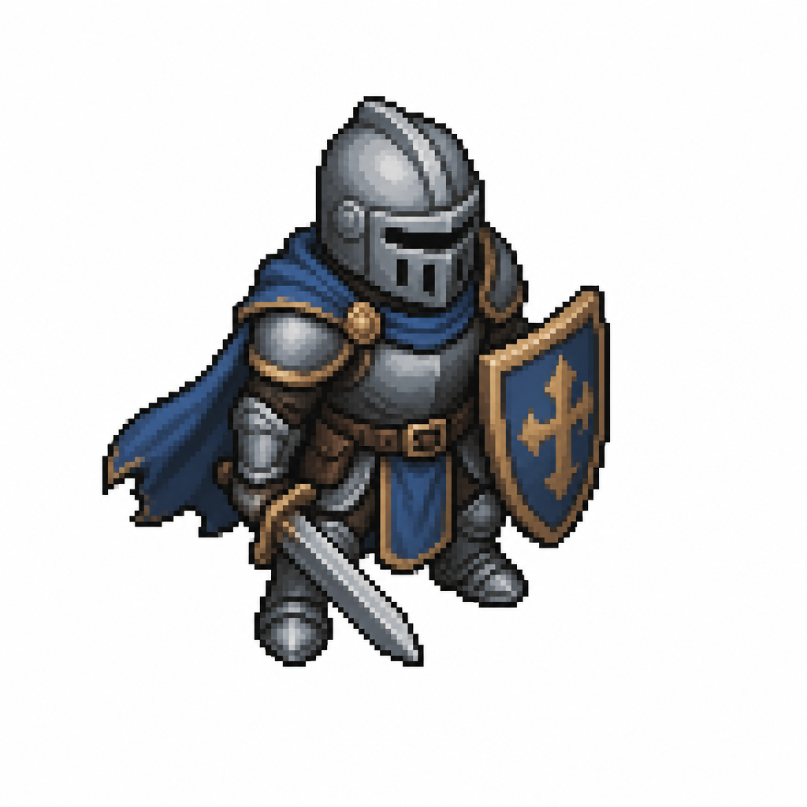
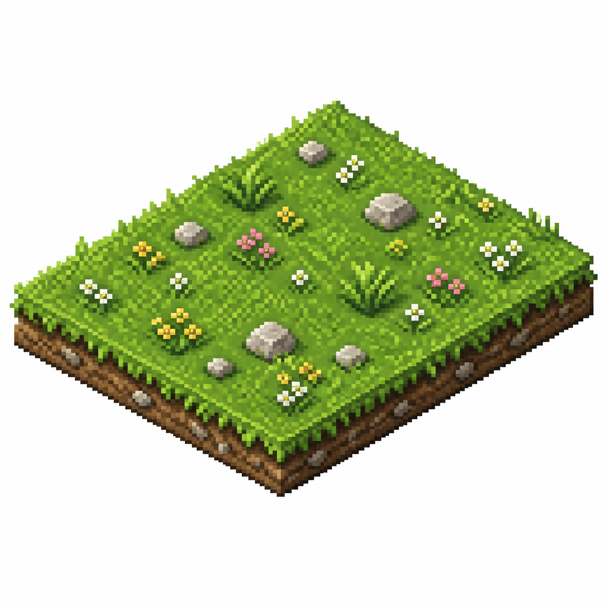
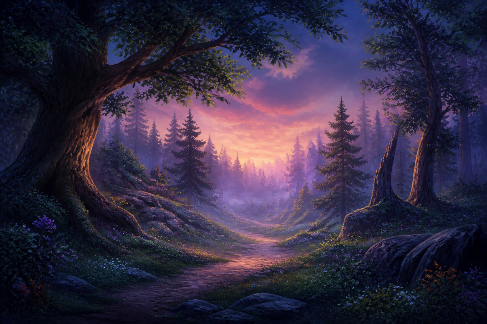
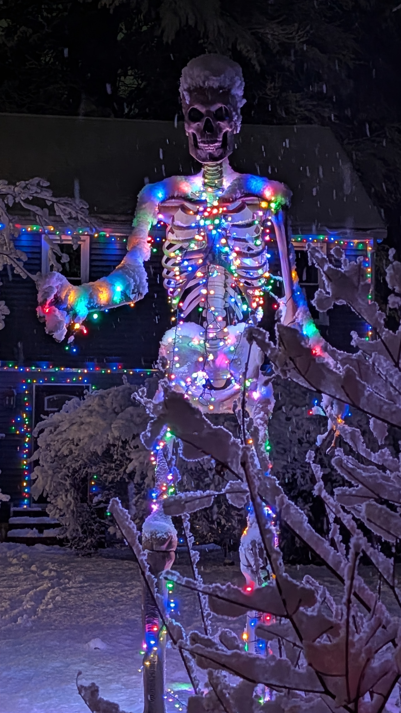
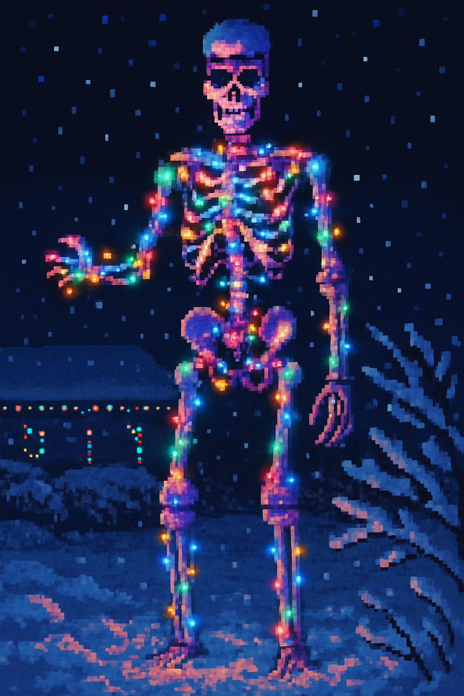
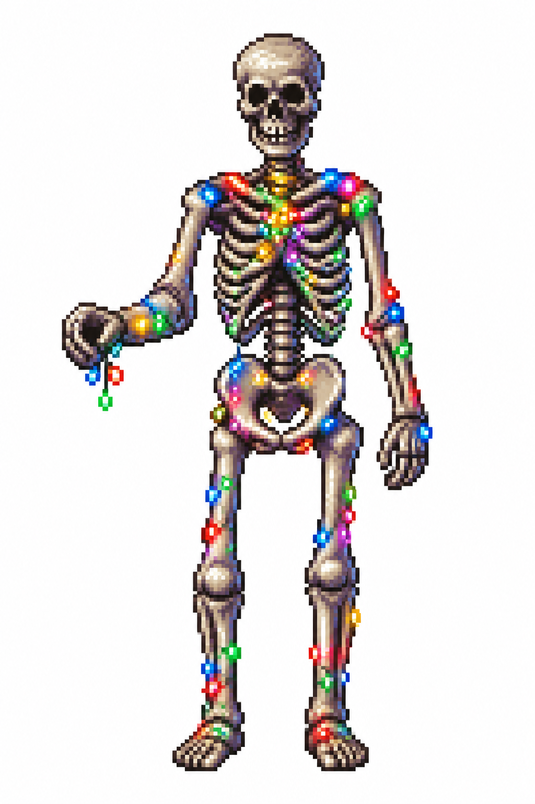

# imagegen2

Generate and edit game-oriented image assets from Codex, Claude Code, Gemini,
or a terminal using OpenAI `gpt-image-2`.

`imagegen2` is based on `github.com/zeveck/imagegen`, updated for GPT Image 2
and packaged as self-contained Agent Skills for multiple coding agents. Use it
for sprites, tiles, item icons, UI elements, portraits, backgrounds, concept
art, and reference-image variants.

## Choosing a Skill

These sibling skills are complementary. The benchmark prompts below are shared
where practical so you can compare outputs without pretending the APIs are
identical.

| Skill | Back end | Good fit | Tradeoffs |
|-------|----------|----------|-----------|
| [`imagegen`](https://github.com/zeveck/imagegen) | OpenAI `gpt-image-1` | Classic game assets, direct transparent PNG/WebP sprites and icons | Older OpenAI image model, legacy size set |
| `imagegen2` | OpenAI `gpt-image-2` | Current OpenAI image path, flexible sizes up to 4K-class outputs, high-fidelity edits | No native transparent backgrounds; uses an explicit `gpt-image-1.5` fallback only when requested |
| [`nanogen`](https://github.com/zeveck/nanogen) | Google Gemini / Nano Banana image models | Rich style catalog, natural-language edits, multi-image composition, multi-turn refinement | No native alpha output; often returns JPEG and uses chromakey/post-processing for transparent-style assets |

## Requirements

- Node.js 20.12+.
- An OpenAI API key with GPT Image model access.
- API Organization Verification may be required before GPT Image models work.

Create a project `.env` file:

```bash
cp .env.example .env
```

Set `OPENAI_API_KEY` in `.env`. Optionally set `OPENAI_ORGANIZATION` and
`OPENAI_PROJECT` if your key needs explicit routing.

If a live call returns a verification error, verify the organization in the
OpenAI platform settings. If the organization was just verified and the error
persists, create a new API key for that verified organization/project.

## Benchmark Gallery

These outputs use the prompts in [examples/prompts.md](examples/prompts.md).
The set is intentionally broad enough to reuse across `imagegen`, `imagegen2`,
and `nanogen` for apples-to-apples comparison.

| Sprite | Item icon | Tactical unit |
|:------:|:---------:|:-------------:|
|  |  |  |

| Terrain tile | UI icon | Background |
|:------------:|:-------:|:----------:|
|  |  |  |

Reference-image edit, using the same input photo as `/imagegen`:

| Input photo | `/imagegen` (`gpt-image-1`) | `imagegen2` (`gpt-image-2`) |
|:-----------:|:---------------------------:|:---------------------------:|
|  |  |  |

## Install

The repository ships one canonical CLI for local development plus
self-contained skill folders for Codex, Claude Code, and Gemini. The skill
folders duplicate the tiny zero-dependency CLI so they continue to work when an
agent installs only that folder from GitHub.

```text
cli/generate.cjs
cli/reference.md
.codex/skills/imagegen2/SKILL.md
.codex/skills/imagegen2/generate.cjs
.codex/skills/imagegen2/reference.md
.claude/skills/imagegen2/SKILL.md
.claude/skills/imagegen2/generate.cjs
.claude/skills/imagegen2/reference.md
.gemini/skills/imagegen2/SKILL.md
.gemini/skills/imagegen2/generate.cjs
.gemini/skills/imagegen2/reference.md
```

### Codex

Ask Codex to install the Codex skill folder:

```text
$skill-installer install https://github.com/zeveck/imagegen2/tree/main/.codex/skills/imagegen2
```

Restart Codex after installing so the skill index refreshes. You can also copy
`.codex/skills/imagegen2` into your Codex skills location. The installed skill
runs its bundled `generate.cjs`.

### Claude Code

Ask Claude Code to install the Claude skill folder:

```text
Please install the imagegen2 skill from https://github.com/zeveck/imagegen2/tree/main/.claude/skills/imagegen2 into this project.
```

You can also copy `.claude/skills/imagegen2` into the target project or user
skills directory. Claude Code uses the Claude-specific frontmatter in
`SKILL.md`, including `allowed-tools` and `argument-hint`.

### Gemini

Install the Gemini skill folder:

```bash
gemini skills install https://github.com/zeveck/imagegen2/tree/main/.gemini/skills/imagegen2
```

Or link it while developing:

```bash
gemini skills link .gemini/skills/imagegen2 --scope workspace
```

Run `/skills reload` in Gemini CLI if it does not appear immediately.
If your Gemini CLI version does not accept GitHub tree URLs, clone this repo
and run the `gemini skills link` command against the local
`.gemini/skills/imagegen2` directory.

## CLI

```bash
node cli/generate.cjs \
  --prompt "A 32-bit pixel art cat wearing a top hat, centered, blank background, no text" \
  --output "./generated-images/cat-tophat.png" \
  --quality low \
  --size 1024x1024
```

Migrating from `imagegen`? See
[docs/migration-from-imagegen.md](docs/migration-from-imagegen.md).

Dry-run without an API key:

```bash
node cli/generate.cjs \
  --dry-run \
  --prompt "A pixel art sword" \
  --output "./assets/items/sword.png" \
  --size 2048x1152
```

## Reference Images

Use `--image` to edit or style-match an existing image. Multiple references are
supported.

```bash
node cli/generate.cjs \
  --prompt "Create a potion bottle icon matching the style of these item icons" \
  --output "./assets/items/potion.png" \
  --image "./assets/items/sword.png" \
  --image "./assets/items/shield.png" \
  --quality low
```

Use `--mask` with a PNG alpha mask for regional edits. The API requires the mask
to match the input image's format and size and to include an alpha channel.

## Sizes

`gpt-image-2` accepts `auto` or flexible `WxH` sizes when they satisfy the
documented constraints:

- each edge is `<= 3840`
- each edge is a multiple of `16`
- long-edge to short-edge ratio is `<= 3:1`
- total pixels are between `655360` and `8294400`

Common sizes:

- `1024x1024`
- `1536x1024`
- `1024x1536`
- `2048x2048`
- `2048x1152`
- `3840x2160`
- `2160x3840`
- `auto`

Outputs larger than `2560x1440` total pixels are still experimental in the
OpenAI docs. Use 4K sizes intentionally.

## Transparent Backgrounds

OpenAI docs state that `gpt-image-2` does not currently support
`background: "transparent"`. The CLI rejects transparent requests by default.

For true native alpha output, explicitly opt into the fallback model:

```bash
node .codex/skills/imagegen2/generate.cjs \
  --prompt "A clean pixel art health potion icon, standalone, no shadow, no text" \
  --output "./assets/items/health-potion.png" \
  --background transparent \
  --transparent-mode fallback-model \
  --quality low
```

This uses `gpt-image-1.5` for that request and records the fallback in CLI
output/history. JPEG cannot be used for transparent output; use PNG or WebP.

`--transparent-mode chroma-key` is reserved for a future local post-processing
path and currently fails clearly.

## Common Options

```text
--prompt <string>
--output <path>
--size <auto|WxH>
--quality <low|medium|high|auto>
--background <auto|opaque|transparent>
--transparent-mode <reject|fallback-model|chroma-key>
--output-compression <0-100>     # JPEG/WebP only
--image <path>                   # repeatable, max 16
--mask <png-path>
--client-request-id <id>
--dry-run
```

Run `node cli/generate.cjs --help` for the complete option list, including
history controls and `--model`.

`--input-fidelity` is intentionally unsupported with `gpt-image-2`; image inputs
are processed at high fidelity automatically.

## History

Successful calls append to `.imagegen2-history.jsonl` with prompt, output path,
parameters, request IDs, and any reference images.

## Tests

Offline validation does not call OpenAI:

```bash
npm test
```

Full local validation:

```bash
npm run test:all
```

Live smoke tests are opt-in:

```bash
IMAGEGEN2_LIVE_TEST=1 npm run test:all
```

## Docs Checked

Model, size, transparency, and input-fidelity behavior are based on the current
[OpenAI Image generation guide](https://developers.openai.com/api/docs/guides/image-generation)
and [GPT Image 2 model page](https://developers.openai.com/api/docs/models/gpt-image-2).
